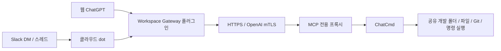

# ChatCmd · Workspace Gateway

**Slack에서 dot에게 개발 작업을 요청하고, dot이 MCP로 작업 공간의 파일·Git·명령 실행을 사용하는 개인용 게이트웨이예요.** 일반 웹 ChatGPT에서도 같은 플러그인을 사용할 수 있어요.

이 저장소는 [nash-agent/ChatCmd](https://github.com/nash-agent/ChatCmd)를 기반으로 한 [pjy1368 포크](https://github.com/pjy1368/ChatCmd)예요. 원본의 여러 AI 클라이언트·브라우저 확장 기능 중, 이 포크의 주된 사용 흐름은 **공유 개발 폴더 → Workspace Gateway 플러그인 → dot → Slack 요청**이에요.

## 동작 방식



- **ChatCmd**는 개발 환경이 있는 호스트에서 실행해요. 관리 화면에서 공유 폴더와 도구 권한을 정해요.
- **Workspace Gateway**는 ChatGPT에 등록하는 MCP 플러그인 이름이에요. 주소를 대화에 적는 것만으로 도구가 등록되지는 않아요.
- **dot**은 계정에 설치·활성화된 지원 플러그인으로 작업해요. 이 구성에서는 dot의 별도 컴퓨터 연결을 켜지 않아요.
- **Slack**은 dot에게 요청하고 결과를 받는 통로예요. ChatCmd에 Slack 봇 토큰을 넣을 필요는 없어요.

## 할 수 있는 작업

공유 범위에서 코드 탐색, 파일 생성·수정, Git 조회, 테스트·빌드·명령 실행, 실행 세션의 출력과 종료 코드 확인을 할 수 있어요. 쓰기와 명령 실행에는 해당 도구 권한도 필요해요.

공유 부모 폴더 아래 저장소는 요청 맨 앞의 이름으로 선택할 수 있어요.

```text
[ch-dropwizard] 이슈 원인을 조사하고 관련 코드와 테스트를 알려주세요.
[another-repo] 버그를 수정하고 관련 테스트를 실행해주세요.
[새 프로젝트: calculator-demo] Python 계산기와 테스트를 만들고 실행해주세요.
```

`[저장소명]`은 실제로 존재하는 직계 하위 폴더 이름이어야 해요. 새 프로젝트 선택에는 공유 부모가 하나여야 해요. 이 선택 기능은 현재 **`feat/shared-project-selection` 브랜치**에 있어요. 실행 중인 서버도 그 버전으로 빌드·교체해야 사용할 수 있어요.

## 시작하기

1. 이 포크의 `feat/shared-project-selection` 브랜치를 빌드하고 ChatCmd를 실행해요.
2. 개발 폴더의 부모 경로를 Projects에 등록하고 모든 대화에 공유해요.
3. 파일 쓰기·명령 실행을 포함하는 Workspace Gateway 접속 프로필을 만들어요.
4. MCP 경로만 HTTPS로 공개하고, ChatGPT에 플러그인을 등록해 웹에서 실제 호출을 확인해요.
5. dot에서 같은 플러그인을 확인한 뒤, dot 프로필에 Slack 연락 수단을 연결해요.

각 단계의 명령과 화면 설정은 아래 상세 가이드에 있어요. 브라우저 확장은 이 흐름의 필수 조건이 아니에요.

## 운영 범위

- 호스트·ChatCmd·프록시·터널이 실행 중이어야 접근할 수 있어요. 호스트의 절전이나 종료 중에는 MCP 작업을 진행할 수 없어요.
- OpenAI mTLS와 비밀 접속 주소는 **OpenAI 클라이언트 + 주소 소지 연결**로 접근을 제한해요. 특정 사용자나 특정 dot만 인증하는 구성은 아니에요.
- 명령은 ChatCmd 실행 계정의 권한으로 실행해요. 공유 폴더 설정이 터미널의 OS 파일·네트워크 접근을 격리하지는 않아요.
- Slack 스레드가 항상 별개의 ChatCmd 작업으로 연결되는지는 실제 `taskId`로 확인해야 해요. 이 포크는 스레드를 합치는 별도 프로젝트 계층을 만들지 않아요.
- Codex의 하네스·설정·MCP 연결이 자동으로 dot에 이식되지는 않아요. 호스트의 CLI와 ChatCmd가 제공하는 도구·프로젝트 스킬을 활용해요.

## dot·Slack 연결 및 사용 가이드

**[상세 설정 가이드: 설치부터 웹 ChatGPT 검증, dot 연결, Slack 요청과 운영까지](docs/DOT_SLACK_SETUP.md)**

처음 설치한다면 가이드를 순서대로 따라가세요. 이미 연결했다면 [공통 작업 지침](docs/DOT_SLACK_SETUP.md#공통-작업-지침)과 [문제 해결](docs/DOT_SLACK_SETUP.md#문제-해결)에서 시작할 수 있어요.

관련 문서:

- [Windows 빌드 및 Secure MCP Tunnel 대안](docs/PLUGIN_SETUP.md)
- [MCP 도구와 프로젝트 선택 규약](docs/mcp_method.md)
- [개발·빌드 안내](docs/DEVELOPMENT.md)
- [기술 문서 목록](docs/README.md)

## 라이선스와 원본

[MIT License](LICENSE)를 따라요. 원본 [int04/ChatCmd](https://github.com/int04/ChatCmd)와 [nash-agent/ChatCmd](https://github.com/nash-agent/ChatCmd)의 코드와 기여를 기반으로 해요. 원본의 기술 문서는 `docs/`에 유지해요.
